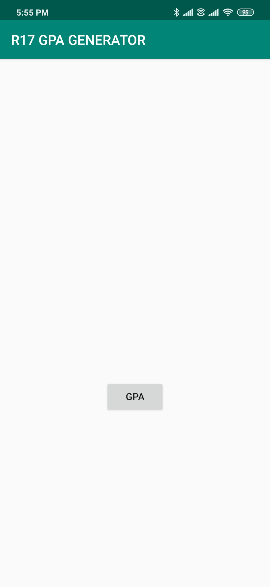
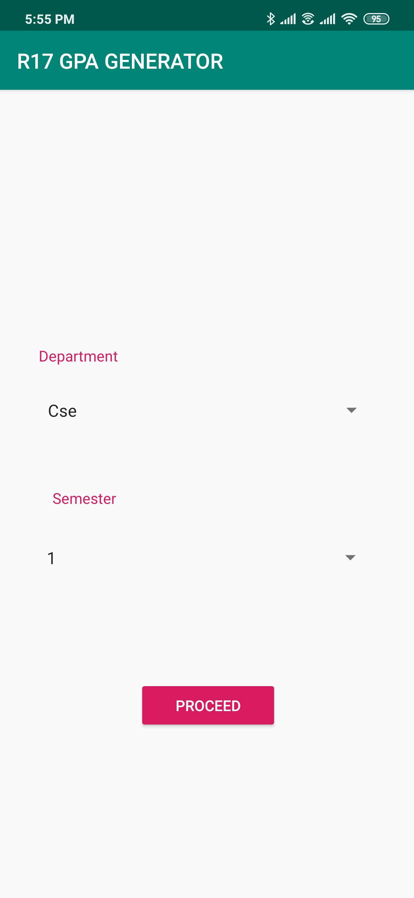
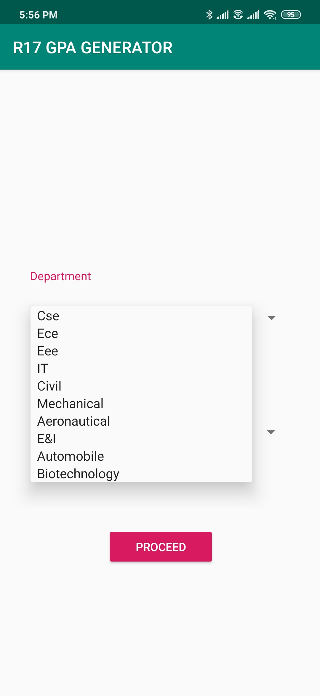
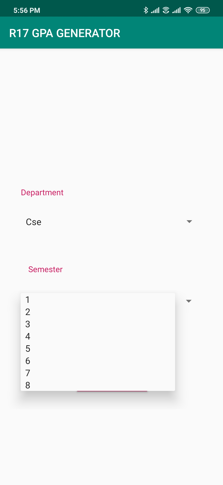
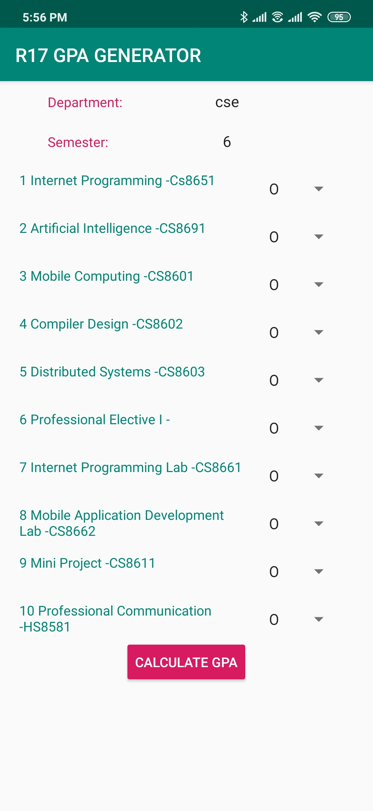

# R17GPAGENERATOR

Ready to release **Android Application For Anna University Under Graduate (UG) Students**(Reg. 2017).

Android Application for Anna university🎓 students to calculate *Grade Point Average(GPA)* for all semesters for departments like:
  ```diff
  1. CSE
  2. IT
  3. AERONAUTICAL
  4. AUTOMOBILE
  5. CIVIL
  6. EEE
  7. ECE
  8. E&I
  9. MECHANICAL
 10. BIO-TECHNOLOGY
  ```


Further CGPA,Credit System,Etc are to be Implemented.


#### You can Reach me at [partheebansms@gmail.com](mailto:partheebansms@gmail.com)

<p align="center">






</p>
